# REQ-005: Database Schema (ERD)

**Status:** Draft
**PRD Reference:** §6 Data Strategy
**Last Updated:** 2025-01-25

---

## 1. Overview

This document consolidates all entity definitions from REQ-001 through REQ-004 into a unified database schema. It serves as the single source of truth for database implementation.

**Key Principle:** This is a consolidation document, not a design document. All design decisions are documented in the source REQ documents. This document enables implementation by providing a complete, cross-referenced view.

### 1.1 Source Documents

| Document | Entities | Version |
|----------|----------|---------|
| REQ-001 Persona Schema | Persona, WorkHistory, Bullet, Skill, Education, Certification, AchievementStory, VoiceProfile, CustomNonNegotiable, PersonaEmbedding | 0.7 |
| REQ-002 Resume Schema | ResumeFile, BaseResume, JobVariant, SubmittedResumePDF, PersonaChangeFlag | 0.7 |
| REQ-002b Cover Letter Schema | CoverLetter, SubmittedCoverLetterPDF | 0.5 |
| REQ-003 Job Posting Schema | JobSource, UserSourcePreference, JobPosting, ExtractedSkill, JobEmbedding, PollingConfiguration | 0.3 |
| REQ-004 Application Schema | Application, TimelineEvent | 0.5 |

---

## 2. Dependencies

### 2.1 This Document Depends On

| Dependency | Type | Notes |
|------------|------|-------|
| REQ-001 Persona Schema v0.7 | Source | Persona, WorkHistory, Bullet, Skill, Education, Certification, AchievementStory, VoiceProfile, CustomNonNegotiable, PersonaEmbedding |
| REQ-002 Resume Schema v0.7 | Source | ResumeFile, BaseResume, JobVariant, SubmittedResumePDF, PersonaChangeFlag |
| REQ-002b Cover Letter Schema v0.5 | Source | CoverLetter, SubmittedCoverLetterPDF |
| REQ-003 Job Posting Schema v0.3 | Source | JobSource, UserSourcePreference, JobPosting, ExtractedSkill, PollingConfiguration |
| REQ-004 Application Schema v0.5 | Source | Application, TimelineEvent |

### 2.2 Other Documents Depend On This

| Document | Dependency | Notes |
|----------|------------|-------|
| FEAT-005 Database Migrations | Direct implementation | Migration scripts built from this ERD |

---

## 3. Entity Relationship Diagram

```mermaid
erDiagram
    %% ============================================
    %% USER (Auth Foundation)
    %% ============================================

    User ||--|| Persona : "owns"

    %% ============================================
    %% PERSONA DOMAIN (REQ-001)
    %% ============================================

    Persona ||--o{ WorkHistory : "has"
    Persona ||--o{ Skill : "has"
    Persona ||--o{ Education : "has"
    Persona ||--o{ Certification : "has"
    Persona ||--o{ AchievementStory : "has"
    Persona ||--o| VoiceProfile : "has"
    Persona ||--o{ CustomNonNegotiable : "has"
    Persona ||--o{ PersonaEmbedding : "has"

    WorkHistory ||--o{ Bullet : "has"
    AchievementStory }o--o| WorkHistory : "related_to"

    %% ============================================
    %% RESUME DOMAIN (REQ-002)
    %% ============================================

    Persona ||--o| ResumeFile : "uploaded"
    Persona ||--o{ BaseResume : "has"
    Persona ||--o{ PersonaChangeFlag : "has"

    BaseResume ||--o{ JobVariant : "spawns"
    JobVariant ||--o| SubmittedResumePDF : "generates"

    %% ============================================
    %% COVER LETTER DOMAIN (REQ-002b)
    %% ============================================

    Persona ||--o{ CoverLetter : "has"
    CoverLetter ||--o| SubmittedCoverLetterPDF : "generates"

    %% ============================================
    %% JOB POSTING DOMAIN (REQ-003)
    %% ============================================

    JobSource ||--o{ UserSourcePreference : "configured_by"
    JobSource ||--o{ JobPosting : "provides"
    Persona ||--o{ UserSourcePreference : "has"
    Persona ||--o| PollingConfiguration : "has"
    Persona ||--o{ JobPosting : "discovered_for"

    JobPosting ||--o{ ExtractedSkill : "has"
    JobPosting ||--o{ JobEmbedding : "has"
    JobPosting }o--o{ JobPosting : "previous_posting"

    %% ============================================
    %% APPLICATION DOMAIN (REQ-004)
    %% ============================================

    Persona ||--o{ Application : "has"
    JobPosting ||--o| Application : "applied_to"
    JobVariant ||--o| Application : "used_in"
    CoverLetter ||--o| Application : "used_in"

    Application ||--o{ TimelineEvent : "has"
    Application ||--o| SubmittedResumePDF : "links"
    Application ||--o| SubmittedCoverLetterPDF : "links"
```



---

## 4. Table Definitions

### 4.0 User (Auth Foundation)

#### User

Minimal user table for authentication. Required for `user_id` FK in Persona.

| Column | Type | Nullable | Default | Constraints |
|--------|------|----------|---------|-------------|
| id | UUID | NO | gen_random_uuid() | PK |
| email | VARCHAR(255) | NO | | UNIQUE |
| created_at | TIMESTAMPTZ | NO | now() | |

**Indexes:**
- `idx_users_email` on (email) — UNIQUE

**Notes:**
- MVP (local mode): Pre-populated with single default user. `DEFAULT_USER_ID` env var references this.
- Future (hosted mode): Expanded with password hash, OAuth provider fields, etc.
- Kept minimal intentionally — auth system may be replaced/extended later.

---

### 4.1 Persona Domain (REQ-001)

#### Persona

| Column | Type | Nullable | Default | Constraints |
|--------|------|----------|---------|-------------|
| id | UUID | NO | gen_random_uuid() | PK |
| user_id | UUID | NO | | FK → User table (auth system) |
| email | VARCHAR(255) | NO | | UNIQUE |
| full_name | VARCHAR(255) | NO | | |
| phone | VARCHAR(50) | NO | | |
| linkedin_url | VARCHAR(500) | YES | | |
| portfolio_url | VARCHAR(500) | YES | | |
| home_city | VARCHAR(100) | NO | | |
| home_state | VARCHAR(100) | NO | | |
| home_country | VARCHAR(100) | NO | | |
| professional_summary | TEXT | YES | | General career overview; source material for role-specific Base Resume summaries |
| years_experience | INTEGER | YES | | Self-reported total years; used for job matching (e.g., "5+ years required") |
| current_role | VARCHAR(255) | YES | | How user identifies professionally (may differ from literal job title) |
| current_company | VARCHAR(255) | YES | | Current employer for display; may differ from WorkHistory if multiple jobs |
| target_roles | JSONB | YES | '[]' | |
| target_skills | JSONB | YES | '[]' | |
| stretch_appetite | VARCHAR(20) | NO | 'Medium' | CHECK (Low, Medium, High) |
| minimum_base_salary | INTEGER | YES | | |
| salary_currency | VARCHAR(10) | YES | 'USD' | |
| commutable_cities | JSONB | YES | '[]' | |
| max_commute_minutes | INTEGER | YES | | |
| remote_preference | VARCHAR(30) | NO | 'No Preference' | CHECK (Remote Only, Hybrid OK, Onsite OK, No Preference) |
| relocation_open | BOOLEAN | NO | false | |
| relocation_cities | JSONB | YES | '[]' | |
| visa_sponsorship_required | BOOLEAN | NO | false | |
| industry_exclusions | JSONB | YES | '[]' | |
| company_size_preference | VARCHAR(30) | YES | | CHECK (Startup, Mid-size, Enterprise, No Preference) |
| max_travel_percent | VARCHAR(20) | YES | | CHECK (None, <25%, <50%, Any) |
| minimum_fit_threshold | INTEGER | NO | 50 | CHECK (0-100) |
| polling_frequency | VARCHAR(20) | NO | 'Daily' | CHECK (Daily, Twice Daily, Weekly, Manual Only) |
| auto_draft_threshold | INTEGER | NO | 90 | CHECK (0-100) |
| onboarding_complete | BOOLEAN | NO | false | |
| onboarding_step | VARCHAR(50) | YES | | Current step if incomplete |
| original_resume_file_id | UUID | YES | | FK → ResumeFile ON DELETE SET NULL |
| created_at | TIMESTAMPTZ | NO | now() | |
| updated_at | TIMESTAMPTZ | NO | now() | |

**Indexes:**
- `idx_personas_user_id` on (user_id)
- `idx_personas_email` on (email)

---

#### WorkHistory

| Column | Type | Nullable | Default | Constraints |
|--------|------|----------|---------|-------------|
| id | UUID | NO | gen_random_uuid() | PK |
| persona_id | UUID | NO | | FK → Persona ON DELETE CASCADE |
| company_name | VARCHAR(255) | NO | | |
| company_industry | VARCHAR(100) | YES | | |
| job_title | VARCHAR(255) | NO | | |
| start_date | DATE | NO | | |
| end_date | DATE | YES | | |
| is_current | BOOLEAN | NO | false | |
| location | VARCHAR(255) | NO | | City, State/Country |
| work_model | VARCHAR(20) | NO | | CHECK (Remote, Hybrid, Onsite) |
| description | TEXT | YES | | |
| display_order | INTEGER | NO | 0 | |
| created_at | TIMESTAMPTZ | NO | now() | |
| updated_at | TIMESTAMPTZ | NO | now() | |

**Indexes:**
- `idx_work_histories_persona_id` on (persona_id)
- `idx_work_histories_persona_id_display_order` on (persona_id, display_order)

---

#### Bullet

| Column | Type | Nullable | Default | Constraints |
|--------|------|----------|---------|-------------|
| id | UUID | NO | gen_random_uuid() | PK |
| work_history_id | UUID | NO | | FK → WorkHistory ON DELETE CASCADE |
| text | TEXT | NO | | |
| skills_demonstrated | JSONB | YES | '[]' | Array of Skill IDs |
| metrics | VARCHAR(255) | YES | | Quantified results |
| display_order | INTEGER | NO | 0 | |
| created_at | TIMESTAMPTZ | NO | now() | |
| updated_at | TIMESTAMPTZ | NO | now() | |

**Indexes:**
- `idx_bullets_work_history_id` on (work_history_id)
- `idx_bullets_work_history_id_display_order` on (work_history_id, display_order)

---

#### Skill

| Column | Type | Nullable | Default | Constraints |
|--------|------|----------|---------|-------------|
| id | UUID | NO | gen_random_uuid() | PK |
| persona_id | UUID | NO | | FK → Persona ON DELETE CASCADE |
| skill_name | VARCHAR(100) | NO | | |
| skill_type | VARCHAR(20) | NO | | CHECK (Hard, Soft) |
| category | VARCHAR(100) | NO | | Predefined + custom allowed |
| proficiency | VARCHAR(20) | NO | | CHECK (Learning, Familiar, Proficient, Expert) |
| years_used | INTEGER | NO | | |
| last_used | VARCHAR(20) | NO | | "Current" or year (e.g., "2023") |
| display_order | INTEGER | NO | 0 | |
| created_at | TIMESTAMPTZ | NO | now() | |
| updated_at | TIMESTAMPTZ | NO | now() | |

**Indexes:**
- `idx_skills_persona_id` on (persona_id)
- `idx_skills_persona_id_skill_name` on (persona_id, skill_name) UNIQUE

---

#### Education

| Column | Type | Nullable | Default | Constraints |
|--------|------|----------|---------|-------------|
| id | UUID | NO | gen_random_uuid() | PK |
| persona_id | UUID | NO | | FK → Persona ON DELETE CASCADE |
| institution | VARCHAR(255) | NO | | |
| degree | VARCHAR(100) | NO | | |
| field_of_study | VARCHAR(255) | NO | | |
| graduation_year | INTEGER | NO | | |
| gpa | DECIMAL(3,2) | YES | | |
| honors | VARCHAR(255) | YES | | |
| display_order | INTEGER | NO | 0 | |
| created_at | TIMESTAMPTZ | NO | now() | |
| updated_at | TIMESTAMPTZ | NO | now() | |

**Indexes:**
- `idx_educations_persona_id` on (persona_id)

---

#### Certification

| Column | Type | Nullable | Default | Constraints |
|--------|------|----------|---------|-------------|
| id | UUID | NO | gen_random_uuid() | PK |
| persona_id | UUID | NO | | FK → Persona ON DELETE CASCADE |
| certification_name | VARCHAR(255) | NO | | |
| issuing_organization | VARCHAR(255) | NO | | |
| date_obtained | DATE | NO | | |
| expiration_date | DATE | YES | | NULL = No Expiration |
| credential_id | VARCHAR(100) | YES | | |
| verification_url | VARCHAR(500) | YES | | |
| display_order | INTEGER | NO | 0 | |
| created_at | TIMESTAMPTZ | NO | now() | |
| updated_at | TIMESTAMPTZ | NO | now() | |

**Indexes:**
- `idx_certifications_persona_id` on (persona_id)

---

#### AchievementStory

| Column | Type | Nullable | Default | Constraints |
|--------|------|----------|---------|-------------|
| id | UUID | NO | gen_random_uuid() | PK |
| persona_id | UUID | NO | | FK → Persona ON DELETE CASCADE |
| title | VARCHAR(255) | NO | | |
| context | TEXT | NO | | |
| action | TEXT | NO | | |
| outcome | TEXT | NO | | |
| skills_demonstrated | JSONB | YES | '[]' | Array of Skill IDs |
| related_job_id | UUID | YES | | FK → WorkHistory ON DELETE SET NULL |
| display_order | INTEGER | NO | 0 | |
| created_at | TIMESTAMPTZ | NO | now() | |
| updated_at | TIMESTAMPTZ | NO | now() | |

**Indexes:**
- `idx_achievement_stories_persona_id` on (persona_id)

---

#### VoiceProfile

| Column | Type | Nullable | Default | Constraints |
|--------|------|----------|---------|-------------|
| id | UUID | NO | gen_random_uuid() | PK |
| persona_id | UUID | NO | | FK → Persona ON DELETE CASCADE, UNIQUE |
| tone | TEXT | NO | | e.g., "Direct, confident, avoids buzzwords" |
| sentence_style | TEXT | NO | | e.g., "Short sentences, active voice" |
| vocabulary_level | TEXT | NO | | e.g., "Technical when relevant, otherwise plain English" |
| personality_markers | TEXT | YES | | e.g., "Occasional dry humor" |
| sample_phrases | JSONB | YES | '[]' | e.g., ["I led...", "I built..."] |
| things_to_avoid | JSONB | YES | '[]' | e.g., ["Passionate", "Synergy"] |
| writing_sample_text | TEXT | YES | | Raw text for voice derivation |
| created_at | TIMESTAMPTZ | NO | now() | |
| updated_at | TIMESTAMPTZ | NO | now() | |

**Indexes:**
- `idx_voice_profiles_persona_id` on (persona_id) UNIQUE

---

#### CustomNonNegotiable

| Column | Type | Nullable | Default | Constraints |
|--------|------|----------|---------|-------------|
| id | UUID | NO | gen_random_uuid() | PK |
| persona_id | UUID | NO | | FK → Persona ON DELETE CASCADE |
| filter_name | VARCHAR(255) | NO | | |
| filter_type | VARCHAR(20) | NO | | CHECK (Exclude, Require) |
| filter_value | TEXT | NO | | |
| filter_field | VARCHAR(100) | NO | | |
| created_at | TIMESTAMPTZ | NO | now() | |
| updated_at | TIMESTAMPTZ | NO | now() | |

**Indexes:**
- `idx_custom_non_negotiables_persona_id` on (persona_id)

---

#### PersonaEmbedding

| Column | Type | Nullable | Default | Constraints |
|--------|------|----------|---------|-------------|
| id | UUID | NO | gen_random_uuid() | PK |
| persona_id | UUID | NO | | FK → Persona ON DELETE CASCADE |
| embedding_type | VARCHAR(20) | NO | | CHECK (hard_skills, soft_skills, logistics) |
| vector | VECTOR(1536) | NO | | The embedding vector |
| model_name | VARCHAR(100) | NO | | e.g., "text-embedding-3-small" |
| model_version | VARCHAR(50) | NO | | e.g., "2024-01" |
| source_hash | VARCHAR(64) | NO | | Hash of source data (to detect staleness) |
| created_at | TIMESTAMPTZ | NO | now() | |

**Indexes:**
- `idx_persona_embeddings_persona_id` on (persona_id)
- `idx_persona_embeddings_persona_id_embedding_type` on (persona_id, embedding_type)
- `idx_persona_embeddings_vector` using ivfflat on (vector) — for similarity search

**Note:** Requires pgvector extension.

---

### 4.2 Resume Domain (REQ-002)

#### ResumeFile

| Column | Type | Nullable | Default | Constraints |
|--------|------|----------|---------|-------------|
| id | UUID | NO | gen_random_uuid() | PK |
| persona_id | UUID | NO | | FK → Persona ON DELETE CASCADE |
| file_name | VARCHAR(255) | NO | | |
| file_type | VARCHAR(20) | NO | | CHECK (PDF, DOCX) |
| file_size_bytes | INTEGER | NO | | |
| file_binary | BYTEA | NO | | |
| uploaded_at | TIMESTAMPTZ | NO | now() | |
| is_active | BOOLEAN | NO | true | Only one active per Persona |

**Indexes:**
- `idx_resume_files_persona_id` on (persona_id)
- `idx_resume_files_persona_id_is_active` on (persona_id, is_active) WHERE is_active = true

---

#### BaseResume

| Column | Type | Nullable | Default | Constraints |
|--------|------|----------|---------|-------------|
| id | UUID | NO | gen_random_uuid() | PK |
| persona_id | UUID | NO | | FK → Persona ON DELETE CASCADE |
| name | VARCHAR(100) | NO | | |
| role_type | VARCHAR(255) | NO | | Target role category |
| summary | TEXT | NO | | Role-specific professional summary |
| included_jobs | JSONB | NO | '[]' | Array of WorkHistory IDs |
| job_bullet_selections | JSONB | NO | '{}' | Map: job_id → [bullet_ids] |
| job_bullet_order | JSONB | NO | '{}' | Map: job_id → [bullet_ids in order] |
| included_education | JSONB | YES | '[]' | Array of Education IDs |
| included_certifications | JSONB | YES | '[]' | Array of Certification IDs |
| skills_emphasis | JSONB | YES | '[]' | Array of Skill IDs |
| rendered_document | BYTEA | YES | | Stored PDF anchor document (prevents formatting drift) |
| rendered_at | TIMESTAMPTZ | YES | | When document was last rendered |
| is_primary | BOOLEAN | NO | false | |
| status | VARCHAR(20) | NO | 'Active' | CHECK (Active, Archived) |
| display_order | INTEGER | NO | 0 | |
| created_at | TIMESTAMPTZ | NO | now() | |
| updated_at | TIMESTAMPTZ | NO | now() | |
| archived_at | TIMESTAMPTZ | YES | | |

**Indexes:**
- `idx_base_resumes_persona_id` on (persona_id)
- `idx_base_resumes_persona_id_is_primary` on (persona_id) WHERE is_primary = true
- UNIQUE constraint: one name per persona

**Note:** `rendered_document` stores the actual PDF file of the BaseResume. This serves as an anchor to ensure JobVariants don't drift in formatting, style, or tone. See REQ-002 §11.3 for rationale.

---

#### JobVariant

| Column | Type | Nullable | Default | Constraints |
|--------|------|----------|---------|-------------|
| id | UUID | NO | gen_random_uuid() | PK |
| base_resume_id | UUID | NO | | FK → BaseResume ON DELETE RESTRICT |
| job_posting_id | UUID | NO | | FK → JobPosting ON DELETE RESTRICT |
| summary | TEXT | NO | | |
| job_bullet_order | JSONB | NO | '{}' | |
| modifications_description | TEXT | YES | | |
| status | VARCHAR(20) | NO | 'Draft' | CHECK (Draft, Approved, Archived) |
| snapshot_included_jobs | JSONB | YES | | Populated on approval |
| snapshot_job_bullet_selections | JSONB | YES | | Populated on approval |
| snapshot_included_education | JSONB | YES | | Populated on approval |
| snapshot_included_certifications | JSONB | YES | | Populated on approval |
| snapshot_skills_emphasis | JSONB | YES | | Populated on approval |
| created_at | TIMESTAMPTZ | NO | now() | |
| updated_at | TIMESTAMPTZ | NO | now() | |
| approved_at | TIMESTAMPTZ | YES | | |
| archived_at | TIMESTAMPTZ | YES | | |

**Indexes:**
- `idx_job_variants_base_resume_id` on (base_resume_id)
- `idx_job_variants_job_posting_id` on (job_posting_id)
- `idx_job_variants_status` on (status)

---

#### SubmittedResumePDF

| Column | Type | Nullable | Default | Constraints |
|--------|------|----------|---------|-------------|
| id | UUID | NO | gen_random_uuid() | PK |
| application_id | UUID | YES | | FK → Application ON DELETE SET NULL |
| resume_source_type | VARCHAR(20) | NO | | CHECK (Base, Variant) |
| resume_source_id | UUID | NO | | FK to BaseResume or JobVariant (app-enforced) |
| file_name | VARCHAR(255) | NO | | |
| file_binary | BYTEA | NO | | |
| generated_at | TIMESTAMPTZ | NO | now() | |

**Indexes:**
- `idx_submitted_resume_pdfs_application_id` on (application_id)

**Note:** `application_id` is NULL until user marks "Applied". Orphan cleanup purges records with NULL `application_id` older than 7 days.

---

#### PersonaChangeFlag

| Column | Type | Nullable | Default | Constraints |
|--------|------|----------|---------|-------------|
| id | UUID | NO | gen_random_uuid() | PK |
| persona_id | UUID | NO | | FK → Persona ON DELETE CASCADE |
| change_type | VARCHAR(30) | NO | | CHECK (job_added, bullet_added, skill_added, education_added, certification_added) |
| item_id | UUID | NO | | |
| item_description | VARCHAR(500) | NO | | |
| status | VARCHAR(20) | NO | 'Pending' | CHECK (Pending, Resolved) |
| resolution | VARCHAR(30) | YES | | CHECK (added_to_all, added_to_some, skipped) |
| created_at | TIMESTAMPTZ | NO | now() | |
| resolved_at | TIMESTAMPTZ | YES | | |

**Indexes:**
- `idx_persona_change_flags_persona_id` on (persona_id)
- `idx_persona_change_flags_persona_id_status` on (persona_id, status) WHERE status = 'Pending'

**Note:** Resolved flags older than 30 days are purged by cleanup job.

---

### 4.3 Cover Letter Domain (REQ-002b)

#### CoverLetter

| Column | Type | Nullable | Default | Constraints |
|--------|------|----------|---------|-------------|
| id | UUID | NO | gen_random_uuid() | PK |
| persona_id | UUID | NO | | FK → Persona ON DELETE CASCADE |
| application_id | UUID | YES | | FK → Application ON DELETE SET NULL |
| job_posting_id | UUID | NO | | FK → JobPosting ON DELETE RESTRICT |
| achievement_stories_used | JSONB | NO | '[]' | Array of AchievementStory IDs |
| draft_text | TEXT | NO | | |
| final_text | TEXT | YES | | |
| status | VARCHAR(20) | NO | 'Draft' | CHECK (Draft, Approved, Archived) |
| agent_reasoning | TEXT | YES | | |
| created_at | TIMESTAMPTZ | NO | now() | |
| updated_at | TIMESTAMPTZ | NO | now() | |
| approved_at | TIMESTAMPTZ | YES | | |
| archived_at | TIMESTAMPTZ | YES | | |

**Indexes:**
- `idx_cover_letters_persona_id` on (persona_id)
- `idx_cover_letters_application_id` on (application_id)
- `idx_cover_letters_job_posting_id` on (job_posting_id)

---

#### SubmittedCoverLetterPDF

| Column | Type | Nullable | Default | Constraints |
|--------|------|----------|---------|-------------|
| id | UUID | NO | gen_random_uuid() | PK |
| cover_letter_id | UUID | NO | | FK → CoverLetter ON DELETE RESTRICT |
| application_id | UUID | YES | | FK → Application ON DELETE SET NULL |
| file_name | VARCHAR(255) | NO | | |
| file_binary | BYTEA | NO | | |
| generated_at | TIMESTAMPTZ | NO | now() | |

**Indexes:**
- `idx_submitted_cover_letter_pdfs_application_id` on (application_id)
- `idx_submitted_cover_letter_pdfs_cover_letter_id` on (cover_letter_id)

**Note:** `application_id` is NULL until user marks "Applied". Orphan cleanup purges records with NULL `application_id` older than 7 days.

---

### 4.4 Job Posting Domain (REQ-003)

#### JobSource

Global registry of job sources. System-managed.

| Column | Type | Nullable | Default | Constraints |
|--------|------|----------|---------|-------------|
| id | UUID | NO | gen_random_uuid() | PK |
| source_name | VARCHAR(100) | NO | | UNIQUE |
| source_type | VARCHAR(20) | NO | | CHECK (API, Extension, Manual) |
| description | TEXT | NO | | |
| api_endpoint | VARCHAR(500) | YES | | |
| is_active | BOOLEAN | NO | true | |
| display_order | INTEGER | NO | 0 | |
| created_at | TIMESTAMPTZ | NO | now() | |
| updated_at | TIMESTAMPTZ | NO | now() | |

**Indexes:**
- `idx_job_sources_source_name` on (source_name) UNIQUE

**Seed Data:**
- Adzuna (API)
- The Muse (API)
- RemoteOK (API)
- USAJobs (API)
- Chrome Extension (Extension)
- Manual (Manual)

---

#### UserSourcePreference

Per-user source settings.

| Column | Type | Nullable | Default | Constraints |
|--------|------|----------|---------|-------------|
| id | UUID | NO | gen_random_uuid() | PK |
| persona_id | UUID | NO | | FK → Persona ON DELETE CASCADE |
| source_id | UUID | NO | | FK → JobSource ON DELETE CASCADE |
| is_enabled | BOOLEAN | NO | true | |
| display_order | INTEGER | YES | | |
| created_at | TIMESTAMPTZ | NO | now() | |
| updated_at | TIMESTAMPTZ | NO | now() | |

**Indexes:**
- `idx_user_source_preferences_persona_id` on (persona_id)
- UNIQUE constraint on (persona_id, source_id)

---

#### PollingConfiguration

| Column | Type | Nullable | Default | Constraints |
|--------|------|----------|---------|-------------|
| id | UUID | NO | gen_random_uuid() | PK |
| persona_id | UUID | NO | | FK → Persona ON DELETE CASCADE, UNIQUE |
| last_poll_at | TIMESTAMPTZ | YES | | |
| next_poll_at | TIMESTAMPTZ | YES | | Calculated from Persona.polling_frequency |
| created_at | TIMESTAMPTZ | NO | now() | |
| updated_at | TIMESTAMPTZ | NO | now() | |

**Note:** Polling frequency preference is on Persona table. This table only stores operational state.

**Indexes:**
- `idx_polling_configurations_persona_id` on (persona_id) UNIQUE
- `idx_polling_configurations_next_poll_at` on (next_poll_at) WHERE next_poll_at IS NOT NULL

---

#### JobPosting

| Column | Type | Nullable | Default | Constraints |
|--------|------|----------|---------|-------------|
| id | UUID | NO | gen_random_uuid() | PK |
| persona_id | UUID | NO | | FK → Persona ON DELETE CASCADE |
| external_id | VARCHAR(255) | YES | | |
| source_id | UUID | NO | | FK → JobSource ON DELETE RESTRICT |
| also_found_on | JSONB | YES | '{"sources":[]}' | |
| job_title | VARCHAR(255) | NO | | |
| company_name | VARCHAR(255) | NO | | |
| company_url | VARCHAR(500) | YES | | |
| location | VARCHAR(255) | YES | | |
| work_model | VARCHAR(20) | YES | | CHECK (Remote, Hybrid, Onsite) |
| seniority_level | VARCHAR(20) | YES | | CHECK (Entry, Mid, Senior, Lead, Executive) |
| salary_min | INTEGER | YES | | |
| salary_max | INTEGER | YES | | |
| salary_currency | VARCHAR(10) | YES | | |
| description | TEXT | NO | | |
| culture_text | TEXT | YES | | LLM-extracted culture/values text (REQ-007 §6.4) |
| requirements | TEXT | YES | | |
| years_experience_min | INTEGER | YES | | |
| years_experience_max | INTEGER | YES | | |
| posted_date | DATE | YES | | |
| application_deadline | DATE | YES | | |
| source_url | VARCHAR(1000) | YES | | |
| apply_url | VARCHAR(1000) | YES | | |
| raw_text | TEXT | YES | | |
| status | VARCHAR(20) | NO | 'Discovered' | CHECK (Discovered, Dismissed, Applied, Expired) |
| is_favorite | BOOLEAN | NO | false | |
| fit_score | INTEGER | YES | | CHECK (0-100) |
| stretch_score | INTEGER | YES | | CHECK (0-100) |
| failed_non_negotiables | JSONB | YES | | |
| description_hash | VARCHAR(64) | NO | | SHA-256 |
| repost_count | INTEGER | NO | 0 | |
| previous_posting_ids | JSONB | YES | '[]' | |
| ghost_score | INTEGER | NO | 0 | CHECK (0-100) |
| ghost_signals | JSONB | YES | | |
| first_seen_date | DATE | NO | | |
| last_verified_at | TIMESTAMPTZ | YES | | |
| created_at | TIMESTAMPTZ | NO | now() | |
| updated_at | TIMESTAMPTZ | NO | now() | |
| dismissed_at | TIMESTAMPTZ | YES | | |
| expired_at | TIMESTAMPTZ | YES | | |

**Indexes:**
- `idx_job_postings_persona_id` on (persona_id)
- `idx_job_postings_persona_id_status` on (persona_id, status)
- `idx_job_postings_source_id` on (source_id)
- `idx_job_postings_source_id_external_id` on (source_id, external_id)
- `idx_job_postings_description_hash` on (description_hash)
- `idx_job_postings_company_name` on (company_name)
- `idx_job_postings_persona_id_fit_score` on (persona_id, fit_score DESC) WHERE status = 'Discovered'

---

#### ExtractedSkill

Skills extracted from job posting for matching.

| Column | Type | Nullable | Default | Constraints |
|--------|------|----------|---------|-------------|
| id | UUID | NO | gen_random_uuid() | PK |
| job_posting_id | UUID | NO | | FK → JobPosting ON DELETE CASCADE |
| skill_name | VARCHAR(100) | NO | | |
| skill_type | VARCHAR(20) | NO | | CHECK (Hard, Soft) |
| is_required | BOOLEAN | NO | true | |
| years_requested | INTEGER | YES | | |
| created_at | TIMESTAMPTZ | NO | now() | |

**Indexes:**
- `idx_extracted_skills_job_posting_id` on (job_posting_id)

---

#### JobEmbedding

Vector embeddings for job matching. Stores requirements and culture embeddings for cosine similarity searches against persona embeddings. Follows the same `EmbeddingColumnsMixin` pattern as `PersonaEmbedding`.

| Column | Type | Nullable | Default | Constraints |
|--------|------|----------|---------|-------------|
| id | UUID | NO | gen_random_uuid() | PK |
| job_posting_id | UUID | NO | | FK → JobPosting ON DELETE CASCADE |
| embedding_type | VARCHAR(20) | NO | | CHECK (requirements, culture) |
| vector | VECTOR(1536) | NO | | The embedding vector |
| model_name | VARCHAR(100) | NO | | e.g., "text-embedding-3-small" |
| model_version | VARCHAR(50) | NO | | e.g., "2024-01" |
| source_hash | VARCHAR(64) | NO | | Hash of source data (to detect staleness) |
| created_at | TIMESTAMPTZ | NO | now() | |

**Indexes:**
- `idx_jobembedding_jobposting` on (job_posting_id)
- `idx_jobembedding_type` on (job_posting_id, embedding_type)
- `idx_jobembedding_vector` using ivfflat on (vector) — for similarity search

**Note:** Requires pgvector extension. Shares column structure with PersonaEmbedding (§4.1) via code-level mixin (`EmbeddingColumnsMixin`). `embedding_type` values differ: persona uses (hard_skills, soft_skills, logistics), job uses (requirements, culture).

---

### 4.5 Application Domain (REQ-004)

#### Application

| Column | Type | Nullable | Default | Constraints |
|--------|------|----------|---------|-------------|
| id | UUID | NO | gen_random_uuid() | PK |
| persona_id | UUID | NO | | FK → Persona ON DELETE CASCADE |
| job_posting_id | UUID | NO | | FK → JobPosting ON DELETE RESTRICT |
| job_variant_id | UUID | NO | | FK → JobVariant ON DELETE RESTRICT |
| cover_letter_id | UUID | YES | | FK → CoverLetter ON DELETE SET NULL |
| submitted_resume_pdf_id | UUID | YES | | FK → SubmittedResumePDF ON DELETE SET NULL |
| submitted_cover_letter_pdf_id | UUID | YES | | FK → SubmittedCoverLetterPDF ON DELETE SET NULL |
| job_snapshot | JSONB | NO | | Frozen copy of JobPosting at application time |
| status | VARCHAR(20) | NO | 'Applied' | CHECK (Applied, Interviewing, Offer, Accepted, Rejected, Withdrawn) |
| current_interview_stage | VARCHAR(30) | YES | | CHECK (Phone Screen, Onsite, Final Round) |
| offer_details | JSONB | YES | | |
| rejection_details | JSONB | YES | | |
| notes | TEXT | YES | | |
| applied_at | TIMESTAMPTZ | NO | now() | |
| status_updated_at | TIMESTAMPTZ | NO | now() | |
| created_at | TIMESTAMPTZ | NO | now() | |
| updated_at | TIMESTAMPTZ | NO | now() |

**Note:** `job_snapshot` stores title, company, description, requirements, salary, URL at application time. See REQ-004 §4.1a for schema.

**Indexes:**
- `idx_applications_persona_id` on (persona_id)
- `idx_applications_job_posting_id` on (job_posting_id)
- `idx_applications_persona_id_status` on (persona_id, status)
- UNIQUE constraint on (persona_id, job_posting_id) — one application per job per user

---

#### TimelineEvent

| Column | Type | Nullable | Default | Constraints |
|--------|------|----------|---------|-------------|
| id | UUID | NO | gen_random_uuid() | PK |
| application_id | UUID | NO | | FK → Application ON DELETE CASCADE |
| event_type | VARCHAR(30) | NO | | CHECK (applied, status_changed, note_added, interview_scheduled, interview_completed, offer_received, offer_accepted, rejected, withdrawn, follow_up_sent, response_received, custom) |
| event_date | TIMESTAMPTZ | NO | | |
| description | TEXT | YES | | |
| interview_stage | VARCHAR(30) | YES | | CHECK (Phone Screen, Onsite, Final Round) |
| created_at | TIMESTAMPTZ | NO | now() | |

**Indexes:**
- `idx_timeline_events_application_id` on (application_id)
- `idx_timeline_events_application_id_event_date` on (application_id, event_date DESC)

---

## 5. JSONB Schema Definitions

### 5.1 Persona Domain

**target_roles / target_skills / commutable_cities / relocation_cities / industry_exclusions:**
```json
["string1", "string2", "string3"]
```

**sample_phrases / things_to_avoid (VoiceProfile):**
```json
["phrase1", "phrase2", "phrase3"]
```

**skills_demonstrated (AchievementStory / Bullet):**
```json
["skill_uuid_1", "skill_uuid_2"]
```

---

### 5.2 Resume Domain

**included_jobs / included_education / included_certifications / skills_emphasis:**
```json
["uuid_1", "uuid_2", "uuid_3"]
```

**job_bullet_selections:**
```json
{
  "job_uuid_1": ["bullet_uuid_a", "bullet_uuid_b"],
  "job_uuid_2": ["bullet_uuid_c"]
}
```

**job_bullet_order:**
```json
{
  "job_uuid_1": ["bullet_uuid_b", "bullet_uuid_a"],
  "job_uuid_2": ["bullet_uuid_c"]
}
```

---

### 5.3 Job Posting Domain

**also_found_on:**
```json
{
  "sources": [
    {
      "source_id": "uuid",
      "external_id": "linkedin-123",
      "source_url": "https://linkedin.com/jobs/...",
      "found_at": "2025-01-25T12:00:00Z"
    }
  ]
}
```

**failed_non_negotiables:**
```json
{
  "filters_failed": [
    {"filter": "minimum_base_salary", "job_value": 90000, "persona_value": 120000},
    {"filter": "remote_preference", "job_value": "Onsite", "persona_value": "Remote Only"}
  ]
}
```

**ghost_signals:**
```json
{
  "days_open": 47,
  "days_open_score": 50,
  "repost_count": 2,
  "repost_score": 60,
  "vagueness_score": 30,
  "missing_fields": ["salary", "deadline"],
  "missing_fields_score": 50,
  "requirement_mismatch": false,
  "requirement_mismatch_score": 0,
  "calculated_at": "2025-01-25T12:00:00Z"
}
```

**previous_posting_ids:**
```json
["uuid_of_previous_posting_1", "uuid_of_previous_posting_2"]
```

---

### 5.4 Application Domain

**job_snapshot:**
```json
{
  "title": "Senior Scrum Master",
  "company_name": "Acme Corp",
  "company_url": "https://acme.com",
  "description": "Full job description text...",
  "requirements": ["5+ years experience", "CSM certification"],
  "salary_min": 120000,
  "salary_max": 150000,
  "salary_currency": "USD",
  "location": "Austin, TX",
  "work_model": "Hybrid",
  "source_url": "https://linkedin.com/jobs/12345",
  "captured_at": "2026-01-25T10:00:00Z"
}
```

**offer_details:**
```json
{
  "base_salary": 150000,
  "salary_currency": "USD",
  "bonus_percent": 15,
  "equity_value": 50000,
  "equity_type": "RSU",
  "equity_vesting_years": 4,
  "start_date": "2025-03-01",
  "response_deadline": "2025-02-01",
  "other_benefits": "401k match 6%, unlimited PTO",
  "notes": "Negotiated from 140k"
}
```

**rejection_details:**
```json
{
  "stage": "Onsite",
  "reason": "Culture fit concerns",
  "feedback": "Looking for someone more senior",
  "rejected_at": "2025-01-25T10:00:00Z"
}
```

---

## 6. Archive Implementation

All archiving uses soft delete pattern with status field.

| Entity | Status Field | Archive Value | Hard Delete |
|--------|--------------|---------------|-------------|
| BaseResume | status | 'Archived' | Never |
| JobVariant | status | 'Archived' | 180 days after archive |
| CoverLetter | status | 'Archived' | 180 days after archive |
| JobPosting | status | 'Expired' or 'Dismissed' | 180 days after archive |
| Application | (derived from status) | Terminal states | See retention policy |

**Archived records:**
- Hidden from default UI queries
- Recoverable via "Restore" action (before hard delete)
- Excluded via `WHERE status != 'Archived'` in queries

---

## 7. Cleanup Jobs

| Job | Frequency | Action |
|-----|-----------|--------|
| Orphan PDF cleanup | Daily | Delete SubmittedResumePDF and SubmittedCoverLetterPDF where `application_id IS NULL AND generated_at < now() - interval '7 days'` |
| PersonaChangeFlag cleanup | Daily | Delete where `status = 'Resolved' AND resolved_at < now() - interval '30 days'` |
| Hard delete archived | Weekly | Delete JobVariant, CoverLetter where `archived_at < now() - interval '180 days'` |
| Hard delete expired jobs | Weekly | Delete JobPosting where `status IN ('Expired', 'Dismissed') AND updated_at < now() - interval '180 days' AND is_favorite = false` |

---

## 8. Extensions Required

| Extension | Purpose |
|-----------|---------|
| pgvector | Vector similarity search for PersonaEmbedding |
| pgcrypto | UUID generation via gen_random_uuid() |

---

## 9. Migration Notes

### 9.1 Migration Order

Due to foreign key dependencies, tables must be created in this order:

1. **Tier 0 (no FK dependencies):**
   - JobSource
   - User (auth system — not defined in these requirements, assumed to exist)

2. **Tier 1 (User/JobSource FK):**
   - Persona (references User, references ResumeFile but nullable)

3. **Tier 2 (Persona FK):
   - WorkHistory, Skill, Education, Certification, AchievementStory, VoiceProfile, CustomNonNegotiable, PersonaEmbedding
   - ResumeFile, BaseResume, PersonaChangeFlag
   - UserSourcePreference, PollingConfiguration, JobPosting

4. **Tier 3 (deeper FK):**
   - Bullet (WorkHistory)
   - JobVariant (BaseResume, JobPosting)
   - ExtractedSkill (JobPosting)
   - JobEmbedding (JobPosting)
   - CoverLetter (Persona, JobPosting)

5. **Tier 4 (Application dependencies):**
   - Application (Persona, JobPosting, JobVariant, CoverLetter)
   - SubmittedResumePDF (Application — nullable)
   - SubmittedCoverLetterPDF (Application — nullable, CoverLetter)

6. **Tier 5 (Application child):**
   - TimelineEvent (Application)

### 9.2 Circular Reference Note

Application ↔ SubmittedResumePDF has bidirectional FKs:
- Application.submitted_resume_pdf_id → SubmittedResumePDF
- SubmittedResumePDF.application_id → Application

**Resolution:** Both FKs are nullable. Create Application first, then link PDFs, then update both sides.

---

## 10. Open Questions

| # | Question | Status |
|---|----------|--------|
| 1 | PostgreSQL version requirement? | TBD — pgvector requires 11+, recommend 15+ |
| 2 | Connection pooling strategy? | TBD — PgBouncer or built-in |
| 3 | Read replica for search queries? | TBD — defer to scale needs |
| 4 | User table schema? | TBD — assumed to exist from auth system (Supabase, Auth0, etc.) |

---

## 11. Change Log

| Date | Version | Changes |
|------|---------|---------|
| 2025-01-25 | 0.1 | Initial consolidation from REQ-001 through REQ-004 |
| 2025-01-25 | 0.2 | Fixed field mismatches to match source documents (REQ-001 as source of truth). Persona: `location_*` → `home_*`, `phone` now required. WorkHistory: added `company_industry`, `work_model`. Bullet: added `skills_demonstrated`, `metrics`. Skill: added `category`, renamed `years_experience` → `years_used`. Education: changed `start_date`/`end_date` → `graduation_year`, `degree`/`field_of_study` now required. Certification: renamed fields to match REQ-001. AchievementStory: renamed `related_work_history_id` → `related_job_id`. VoiceProfile: restructured to match REQ-001 (text fields instead of enums). Added §2 Dependencies section. Renumbered all sections. |
| 2025-01-25 | 0.3 | Added `user_id` FK to Persona (for multi-user support). Fixed onboarding: `onboarding_status` enum → `onboarding_complete` boolean to match REQ-001. Fixed PersonaEmbedding: corrected `embedding_type` values (hard_skills, soft_skills, logistics), added `model_name`, `source_hash` fields to match REQ-001. Fixed WorkHistory `location` to required (not nullable). |
| 2025-01-25 | 0.4 | Added definitions for Persona fields: `professional_summary`, `years_experience`, `current_role`, `current_company`. These were present but undocumented; now have notes explaining their purpose. |
| 2025-01-25 | 0.5 | Coherence fixes: Removed `polling_frequency` from PollingConfiguration (now only on Persona). Fixed JobPosting `work_model` enum: "On-site" → "Onsite". |
| 2025-01-25 | 0.6 | Added explicit ON DELETE behavior: Application.submitted_resume_pdf_id and submitted_cover_letter_pdf_id → SET NULL. JobPosting.source_id → RESTRICT. |
| 2025-01-25 | 0.7 | Added missing timestamps: JobVariant (updated_at), JobSource (created_at, updated_at), PollingConfiguration (created_at, updated_at), ExtractedSkill (created_at). |
| 2025-01-25 | 0.8 | Updated source document version references in §1.1 and §2.1 to match current versions after coherence audit completion. |
| 2026-01-25 | 0.9 | Added `rendered_document` (BYTEA) and `rendered_at` (TIMESTAMPTZ) to BaseResume table. BaseResume now stores actual PDF as anchor document to prevent formatting/style drift. Updated REQ-002 version reference to 0.7. |
| 2026-01-25 | 0.10 | Added §4.0 User table (auth foundation). Added `job_snapshot` (JSONB) to Application table. Added job_snapshot schema to §5.4. Updated REQ-004 version reference to 0.5. |
| 2026-02-18 | 0.11 | Added JobEmbedding table to §4.4 (was implemented in code but missing from spec). Added to ERD, source document list, and migration tier 3. |
| 2026-02-20 | 0.12 | Renamed all 49 index names from abbreviated convention (e.g., `idx_persona_user`) to explicit `idx_{table}_{column}` convention (e.g., `idx_personas_user_id`) for AI-searchability. See migration 011_rename_indexes. |
